# RLC Devreleri (RLC Circuits)
Bu sayfada devre elemanlarından **kapasitör** ve **endüktör**'ü anlamaya çalışıp RC, RL ve RLC devrelerinin zorlanmış (basamak) ve doğal cevaplarına bakacağız.
## Kapasitör (veya Kondansatör veya Sığa)
Kapasitörün matematiksel modeli

olarak verilmişti. Bu birinci dereceden âdi diferansiyel denklemde eşitliğin her iki tarafının k=t0 anından k=t anına kadar integralini alırsak aşağıdaki ifadeyi elde ederiz.

Normalde zamanı temsil eden yatay eksen değişkenine t dememize rağmen burada t artık belirli bir anı temsil ettiğinden dolayı k dedik. Bu k değişkeni kukla değişken1 olarak bilinir. 
### RC Devresinin Zorlanmış (Basamak) Cevabı
Şimdi, *Şekil 1*'de gördüğümüz üzere güç kaynağı, rezistör ve kapasitörden oluşan RC devresinin basamak cevabını2 analiz edelim.

*Şekil 1:* Güç kaynağına bağlı seri bir RC devresi.

Yukarıdaki devrede ok yönünde dolaşırken Kirchoff'un Gerilimler Yasasını3 (KGY) uygularsak aşağıdaki eşitliği elde ederiz.

-Vcc + Ri(t) + VC(t) = 0

Devremizde kapasitörün üzerinden geçen akım iC(t), aynı yönde tanımlandıklarından dolayı devrede dolaşan akım i(t)'ye eşit (i.e., iC(t)=i(t)). Bunu göz önünde bulundurarak yukarıda elde ettiğimiz ilk denklem olan kapasitörün matematiksel modelini KGY ile elde ettiğimiz denklemde yerine koyacak olursak

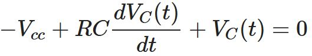

birinci dereceden adi diferansiyel denklemini elde ederiz. Bu denklemi düzenlersek

haline gelir. Biraz daha manipüle edersek

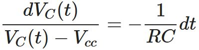

denklemini elde ederiz. Eşitliğin her iki tarafının integralini k=t0'dan k=t anına kadar alalım.

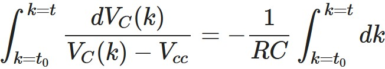

Dikkat edilirse soldaki ifade doğal logaritma ile alakalı bir integral. İntegralleri alarak ilerleyecek olursak

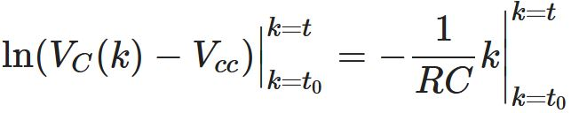

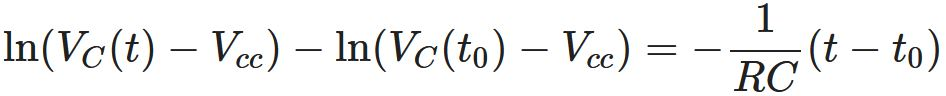

soldaki doğal logaritma içeren ifadelerle yapılan çıkarma işlemi, aşağıdaki halini alırken

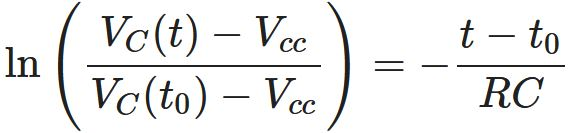

her iki tarafı e ≈ 2.71'in üssü olarak yazarsak (birşey değişmeyeği gibi sol taraftaki doğal logaritma ln ifadesinden kurtulmuş olacağız)

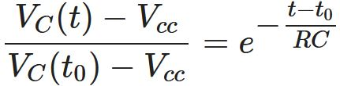

en sonunda aşağıdaki çözümü elde ederiz.

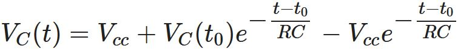

Genelde t0=0 olarak kabul ettiğimizden elde ettiğimiz çözüm aşağıdaki son halini alır.

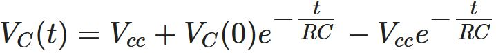

Kapasitörün üzerindeki voltajın analitik çözümü olan bu ifadenin uç (ekstrem) değerlerini düşünecek olursak: t=0 anında VC(0)=VC(0) ve t→∞ durumunda VC(∞)=Vcc olduğunu görebiliriz. Yani zaman ilerledikçe kapasitör voltajı er ya da geç Vcc'ye oturuyor. Burada VC(0)'nin Vcc'ye ulaşma hızını belirleyen zaman sabiti olarak bilinen τ = RC değeri. Zaman sabiti büyüdükçe VC(t)'nin Vcc'ye ulaşması yavaşlarken küçüldükçe de VC(t)'nin Vcc'ye ulaşması hızlanır.

Şimdi elde ettiğimiz çözümün değişik R ve C değerlerine göre grafiklerini çizdirelim ve zaman sabiti τ = RC'nin kapasitörün voltajına olan etkisini görelim.

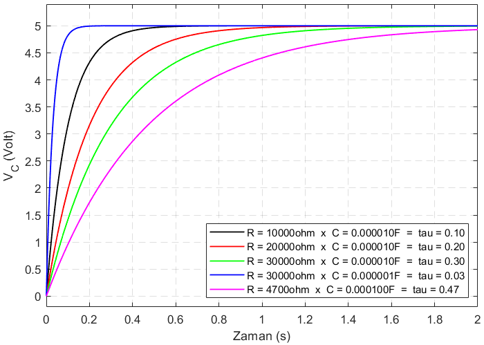

*Şekil 2:* RC devresinin basamak cevabının Vcc = 5V, VC(0) = 0V ve değişik R ve C değerlerine göre çizdirilen grafiği4.

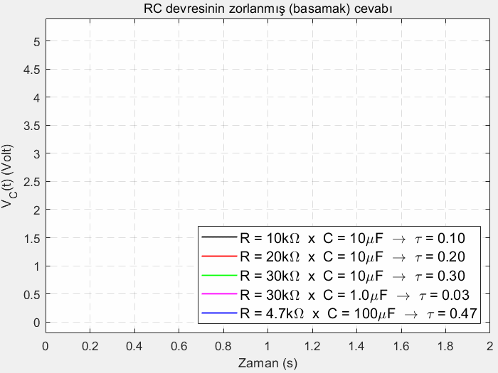

*Şekil 3:* RC devresinin basamak cevabının Vcc = 5V, VC(0) = 0V ve değişik R ve C değerlerine göre çizdirilen animasyonu4.

### RC Devresinin Doğal Cevabı
*Şekil 1*'de verilen devre ve de *Şekil 2*'de alınan cevap *Şekil 4*'deki devrenin t=0'dan t=2'ye kadar olan haline (yani ilk 2 saniyesine) tekabül etmektedir.

*Şekil 4:* RC devresinin anahtarlamalı hali.

Zamanın başlangıcında **SW1** ile gösterilen ilk anahtarın kapanmasıyla Vcc ile gösterilen güç kaynağından devrenin R ve C elemanlarına akım gelmeye başlıyor. Devrenin ortasında yer alan **SW2** anahtarı zamanın başında açık halde. Zaman t=2 saniye olduğu ana kadar devrenin basamak cevabı söz konusu. Zaman t=2s olduğu anda **SW1** açılıyor (yani artık üzerinden akım geçmiyor) ve **SW2** kapanıyor, böylece *Şekil 4*'de verilen anahtarlamalı devre *Şekil 5*'deki halini alıyor.

*Şekil 5:* Yukarıda Vcc ile gösterilen gerilim kaynağının anahtarlamalar vasıtasıyla dışarıda bırakılmasıyla oluşan RC devresi.

Devrede ok yönünde dolaşıp Kirchoff'un Gerilimler Yasasını (KGY) uygularsak elde edeceğimiz denklem aşağıdaki gibi olur.

Devrede kapasitörün depoladığı enerjinin boşalmaya başlamasıyla oluşan akım i(t) kapasitörün üzerinden geçen akım iC(t)'ye ters yönde (i.e., i(t)=−iC(t)). Yukarıda elde edilen denklemde bu değişikliği yaparsak

elde ederiz. Kapasitörün matematiksel modelini kullanarak

elde ederiz. Biraz manipüle edersek

denklemini elde ederiz. Eşitliğin her iki tarafının integralini k=0'dan k=t anına kadar alalım.

Dikkat edilirse soldaki ifade doğal logaritma ile alakalı bir integral. İntegralleri alarak ilerleyecek olursak

ve sınır koşullarını yerlerine koyarsak

soldaki doğal logaritma içeren ifadelerle yapılan çıkarma işlemi, aşağıdaki halini alırken

her iki tarafı e≈2.71'in üssü olarak yazarsak (birşey değişmeyeği gibi sol taraftaki doğal logaritma ln ifadesinden kurtulmuş olacağız)

ve en sonunda RC devresinin doğal cevabını aşağıdaki gibi elde ederiz.

Elde ettiğimiz devrenin t=2s'den t→∞ tepkisine RC devresinin doğal cevabı5 deniyor. RC devresinin doğal cevabının değişik R ve C değerlerine göre çizdirilmiş halini *Şekil 6*'de görebilirsiniz.

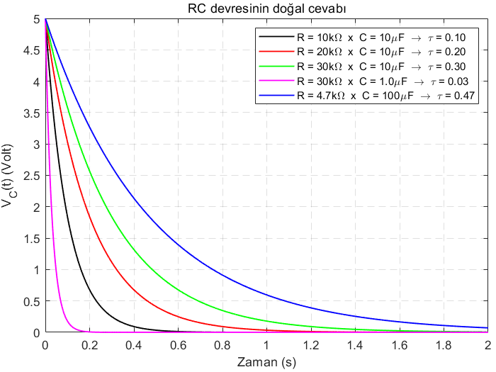

*Şekil 6:* RC devresinin doğal cevabının VC(0) = 5V ve değişik R ve C değerlerine göre grafiği6.

Burada yine kabaca uç (ekstrem) değerlere bakarak analiz yapacak olursak VC(0) = Vcc olarak başlamış. Dikkat edin, eğer RC devresinin ilk 2s'deki cevabında R ve/veya C değerleri yüksek değerler olsaydı, o zaman VC(0) değeri Vcc'den daha düşük bir değer de olabilirdi. Devrede gerilim kaynağının çıkarılması ve **SW2** anahtırının kapanması ile kapasitör üzerinde deoplanmış enerji, direnç R üzerinden zaman sabiti tau = RC ile bağlantılı olarak tükeniyor ve böylece VC(t) zaman ilerlerken sıfırlanıyor.
## Endüktör (veya Bobin)
Endüktörün matematiksel modeli

olarak verilmişti. Bu birinci dereceden adi diferansiyel denklemde eşitliğin her iki tarafının k=t0 anından k=t anına kadar integralini alırsak aşağıdaki çözümü elde ederiz.

Buradaki k isimli kukla değişkenin ne olduğunu derslerimizde ve yukarıda kapasitörün matematiksel modeline bakarken açıkladık.
### RL Devresinin Basamak Cevabı
Aşağıdaki grafikleri sonuç veren denklemler ve nasıl elde edildiklerini gösteren videolar DBS'de.

*Şekil 6:* RL devresine güç kaynağının etki eden hali.

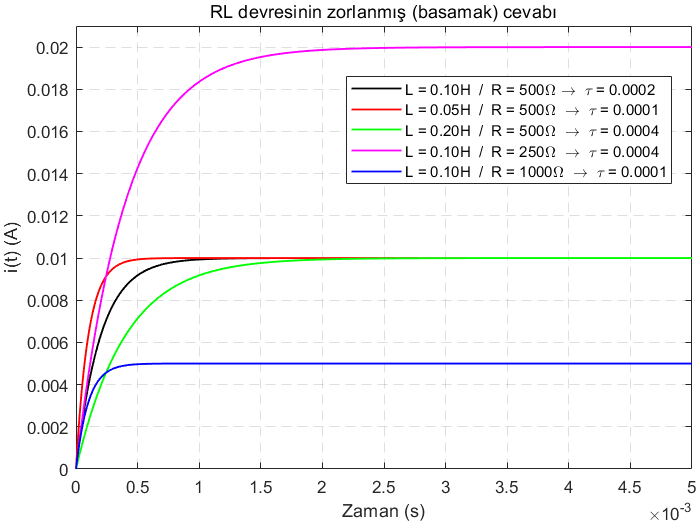

*Şekil 7:* RL devresinin basamak cevabının Vcc = 5V, iL(0) = 0A ve değişik R ve L değerlerine göre çizdirilmiş grafiği7.
### RL Devresinin Doğal Cevabı
Aşağıdaki grafikleri sonuç veren denklemler ve nasıl elde edildiklerini gösteren videolar DBS'de.

*Şekil 8:* RL devresinde t=2s anında anahtarlama ile güç kaynağının etkisiz hale getirilmesi.

*Şekil 9:* *Şekil 8*'de t=2s anından sonra devrenin almış olduğu hal. Devreden geçen akım grafiğine RL devresi doğal cevabı denir.

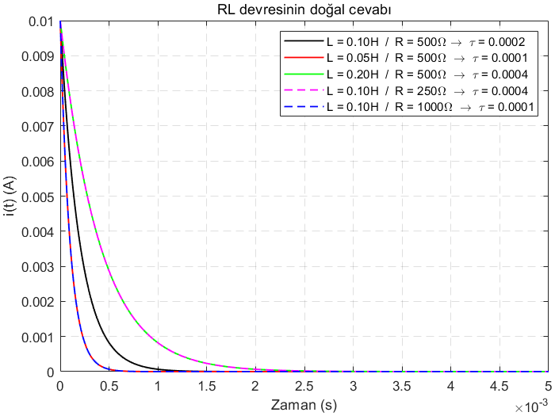

*Şekil 10:* RL devresinin doğal cevabının iL(0) *Şekil 5*'de hangi değere oturduysa kaldığı yerden ve değişik R ve L değerlerine göre grafiği8.
## RLC Devrelerinin Analizi
Yukarıda incelediğimiz devrelerde rezistörün yanında sadece bir kapasitör veya endüktör vardı. Elde ettiğimiz devre denklemleri birinci dereceden adi diferansiyel denklemler olmuştu. Şimdi ise aynı devrede hem kapasitör hem endüktör bulunması durumuna göz atalım. *Şekil 11*'de görüldüğü gibi, içinde iki tane enerji depolayabilen eleman bulunduran bu tarz devrelere RLC devresi deniyor. Bu devrelerin basamak ve doğal cevaplarının matematiksel ifadeleri ikinci dereceden diferansiyel denklemlerle temsil ediliyor.
### Seri RLC Devresi

*Şekil 11:* RLC devresinin seri bağlanmış hali.

Devrede KGY uygulanırsa

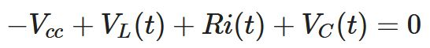

eşitliğini elde ederiz. Bu eşitlik, yukarıda verilen kapasitör ve endüktör modelleri yerlerinde kullanılır ve devrede i(t)=iL(t)=iC(t) olduğu da göz önünde bulundurulursa

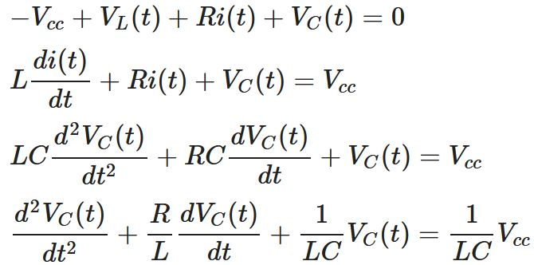

halini alır. Dikkat edin, bu diferansiyel denklemin çözümünde iki adet başlangıç koşulu söz konusu: Kapasitörün t=0s anındaki voltaj değeri olan VC(0) ve endüktörün t=0s anındaki akım değeri olan iL(0). Burada devrenin zorlanmamış cevabına bakmak için denklemin sağ tarafındaki güç kaynağından kaynaklanan terimi sıfırlarsak ve de λ :=d/dt tanımını yaparsak,

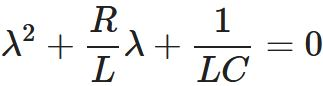

karakteristik denklemini elde deriz. Bu ifadeye göre RLC devresinde kapasitör voltajı ve endüktör akımının davranışını belirleyen faktör Δ olarak bilinen 

Δ=b2-4ac

parametresi olur. Burada a=1, b=R/L ve c=1/LC yerlerine konarsa

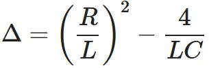

elde edilir. Bu ifadedeki Δ>0, Δ=0 ve Δ<0 durumları için VC(t) ve iL(t) sinyalleri farklı davranışlar (i.e., aşırı sönümlü, kritik sönümlü, eksik sönümlü veya sönümsüz) ortaya koyar. Biz *Şekil 11*'deki devrede L ve C değerlerini sabit tutup değişen R değerleri için cevabı analiz etmek istiyoruz. Endüktör değerini L=1H, kapasitör değerini C=0.01F olarak sabitlersek, o zaman 

Δ=R2-400

olur ki bu durumda Δ>0 olması için R>20, Δ=0 olması için R=20 ve de Δ<0 olması için R<20 olması gerektiği açıktır.
### Analitik Çözüm yerine Nümerik Çözüme Bakalım
Yukarıda RC ve RL devrelerinin basamak ve doğal cevaplarını analiz ederken elde ettiğimiz grafiklerin matematiksel ifadelerini, birinci dereceden diferansiyel denklemleri Kalkülüs bilgilerimizi kullanarak çözerek elde etmiştik. Burada ise, kapalı form çözümü (closed form solution) için çözüm adayı ifadeler önerip başlangıç koşullarından faydalanarak önerilen çözümlerin katsayılarını hesaplayıp çözümün tam ifadesine ulaşabiliriz. Bununla beraber, kapasitör voltajı ve endüktör akımı grafiklerine daha kolay bir yoldan bakmak istersek, elimizdeki ikinci dereceden dinamik ifadeyi *Şekil 11*'de görüldüğü gibi nümerik olarak da koşturabiliriz.9

*Şekil 12:* RLC devresinde kalkülüs kullanarak diferansiyel denklemleri çözüp VC(t) ve iL(t) fonksiyonlarını analitik olarak elde edip çizdirmek yerine benzetiminin (simülasyon) yapılarak nümerik olarak VC(t) ve iL(t) fonksiyonlarının elde edilmesi.

Yukarıda *Şekil 12*'de verilen benzetimi L=1H, C=0.01F ve R = {100, 50, 20, 15, 10, 5, 0}Ω değerleri için t=5s'ye kadar koşturduğumuzda aşağıda verilen *Şekil 13, 14, 15, 16, 17* ve *18*'i elde ettik. 

*Şekil 13:* R=100, L=1, C=0.01 değerleri için *Şekil 11*'de verilen seri RLC devresindeki kapasitör voltajı VC(t) ve endüktör akımı iL(t). R>20 için aşırı sönümlü cevabı elde ettik.

*Şekil 14:* R=50, L=1, C=0.01 değerleri için *Şekil 11*'de verilen seri RLC devresindeki kapasitör voltajı VC(t) ve endüktör akımı iL(t). R>20 için aşırı sönümlü cevabı elde ettik.

*Şekil 15:* R=20, L=1, C=0.01 değerleri için *Şekil 11*'de verilen seri RLC devresindeki kapasitör voltajı VC(t) ve endüktör akımı iL(t). R=20 için kritik sönümlü cevabı elde ettik.

*Şekil 16:* R=15, L=1, C=0.01 değerleri için *Şekil 11*'de verilen seri RLC devresindeki kapasitör voltajı VC(t) ve endüktör akımı iL(t). R=15 için eksik sönümlü cevabı elde ettik.

*Şekil 17:* R=10, L=1, C=0.01 değerleri için *Şekil 11*'de verilen seri RLC devresindeki kapasitör voltajı VC(t) ve endüktör akımı iL(t). R=10 için eksik sönümlü cevabı elde ettik.

*Şekil 18:* R=5, L=1, C=0.01 değerleri için *Şekil 11*'de verilen seri RLC devresindeki kapasitör voltajı VC(t) ve endüktör akımı iL(t). R=5 için eksik sönümlü cevabı elde ettik.

*Şekil 19:* R=0, L=1, C=0.01 değerleri için *Şekil 11*'de verilen seri RLC devresindeki kapasitör voltajı VC(t) ve endüktör akımı iL(t). R=0 için sönümsüz cevabı elde ettik.
## Dipnotlar
1 İng. Dummy variable. 
2 İng. Step response. Basamak cevabı [1]'de geçen bir kavramdır. Aynı kaynağı referans kullanan [2], bu cevabı zorlanmış cevap diye isimlendirerek yaklaşımı daha genelleştirmiştir (i.e., güç kaynağından devreye etki eden sinyalin sadece sabit bir DC gerilim olma şartı yok). Biz burada [1]'de geçen haliyle kullanmayı uygun gördük.  
3 İng. Kirchoff's Voltage Law (KVL). 
4 Bu grafik **MATLAB**'da çizdirilmiştir. Siz de **MATLAB**'da çizdirmek için *kodlar* dizinindeki *RC_devresi_zorlanmis_cevap.m* programını koşturun. 
5 İng. Natural response. 
6 Bu grafik  **MATLAB** ile çizdirilmiştir. Siz de **MATLAB** ile çizdirmek için *kodlar* dizinindeki *RC_devresi_dogal_cevap.m* programını koşturun. 
7 Bu grafik **MATLAB**'da çizdirilmiştir. Siz de **MATLAB**'da çizdirmek için *kodlar* dizinindeki *RL_devresi_zorlanmis_cevap.m* programını koşturun. 
8 Bu grafik  **MATLAB** ile çizdirilmiştir. Siz de **MATLAB** ile çizdirmek için *kodlar* dizinindeki *RL_devresi_dogal_cevap.m* programını koşturun. 
9 Bu benzetimi *kodlar* dizininde *RLC_devresi.mdl* dosyasında görebilirsiniz. Benzetimi koşturmak için *init_RLC_devresi.m* programını koşturun. 
10 Bu grafik  **MATLAB** ile çizdirilmiştir. Siz de **MATLAB** ile çizdirmek için *kodlar* dizinindeki *init_RLC_devresi.m* programını koşturun.
## Referanslar
[1] J. W. Nilsson, S. A. Riedel, *Electric Circuits*, 10. Baskı, Prentice Hall, Upper Saddle River, New Jersey, 2014. 
[2] M. Ö. Efe, *Devre Analizi-I*, 3. Baskı, Seçkin Yayıncılık, 2016.
