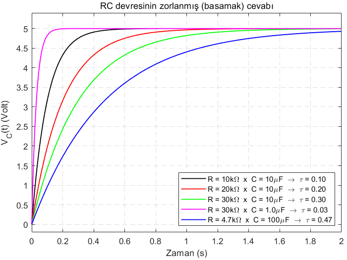
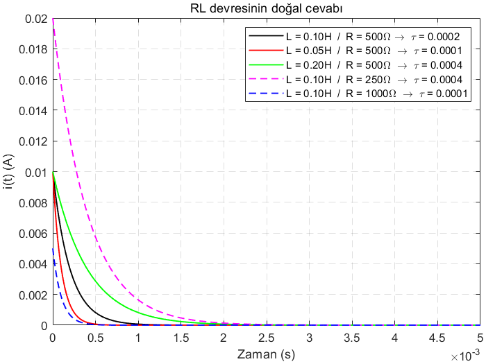

# RLC Devreleri (RLC Circuits)
Bu sayfada kapasitör ve endüktör devre elemanlarını anlamaya çalışıp RC, RL ve RLC devrelerinin basamak (zorlanmış) ve doğal cevaplarına bakacağız.
## RC devresi
Kapasitörün matematiksel modeli

olarak verilmişti. Bu birinci dereceden adi diferansiyel denklemde eşitliğin her iki tarafının k=t0 anından k=t anına kadar integralini alırsak aşağıdaki çözümü elde ederiz.

Buradaki k denilen kukla değişkene1 derslerimizde τ demiştik. Aşağıda zaman sabiti (time constant) kavramı karşımıza çıktığında zaman sabitine τ diyeceğimizden, bundan sonra karışıklık olmasın diye integral alırken zamanı temsil eden yatay ekseni k notasyonu ile göstereceğiz. 
Şimdi, *Şekil 1*'de gördüğümüz üzere bir güç kaynağı, bir rezistör ve bir kapasitörden oluşan RC devresinin basamak cevabını2 analiz edelim.

*Şekil 1:* RC devresi.

*Şekil 1*'de gösterilen devrede ok yönünde dolaşırken Kirchoff'un Gerilimler Yasasını (KGY) uygularsak aşağıdaki eşitliği elde ederiz.

-Vcc + Ri(t) + VC(t) = 0

Devremizde kapasitörün üzerinden geçen akım iC(t), aynı yönde tamamlandıklarından dolayı devrede dolaşan akım i(t)'ye eşit (i.e., iC(t)=i(t)). Bunu göz önünde bulundurarak yukarıda elde ettiğimiz ilk denklem olan kapasitörün matematiksel modelini KGY ile elde ettiğimiz denklemde yerine koyacak olursak

birinci dereceden adi diferansiyel denklemini elde ederiz. Bu denklemi düzenlersek

haline gelir. Biraz daha manipüle edersek

denklemini elde ederiz. Eşitliğin her iki tarafının integralini k=t0'dan k=t anına kadar alalım.

Dikkat edilirse soldaki ifade doğal logaritma ile alakalı bir integral. İntegralleri alarak ilerleyecek olursak

soldaki doğal logaritma içeren ifadelerle yapılan çıkarma işlemi, aşağıdaki halini alırken

her iki tarafı e ≈ 2.71'in üssü olarak yazarsak (birşey değişmeyeği gibi sol taraftaki doğal logaritma ln ifadesinden kurtulmuş olacağız)

en sonunda aşağıdaki çözümü elde ederiz.

Genelde t0=0 olarak kabul ettiğimizden elde ettiğimiz çözüm aşağıdaki son halini alır.

Aşağıda grafiğini çizdireceğimiz kapasitörün üzerindeki voltajın matematiksel ifadesi olan bu ifade hakkında hemen kabaca (yani ekstrem değerlere bakarak) düşünecek olursak t=0 anında VC(0)=VC(0) ve t→∞ durumunda VC(∞)=Vcc olduğunu görebiliriz. Ayrıca zaman sabitimiz olan τ = RC arttıkça VC(t)'nin Vcc'ye ulaşması yavaşlarken τ azalırken VC(t)'nin Vcc'ye ulaşması hızlanır.

Şimdi elde ettiğimiz çözümün değişik R ve C değerlerine göre grafiklerini çizdirelim ve zaman sabitinin kapasitörün voltajına olan etkisini görelim.

*Şekil 2:* RC devresinin basamak cevabının Vcc = 5V, VC(0) = 0V ve değişik R ve C değerlerine göre grafiği3.

*Şekil 3:* RC devresinin doğal cevabının VC(0) = 5V ve değişik R ve C değerlerine göre grafiği4. Anahtarlama ile *Şekil 2*'de kaldığı durumdan devam edilmiştir.

*Şekil 4:* RL devresi.

*Şekil 5:* RL devresinin basamak cevabının Vcc = 5V, iL(0) = 0A ve değişik R ve L değerlerine göre grafiği5.

*Şekil 6:* RL devresinin doğal cevabının iL(0) *Şekil 5*'de hangi değere oturduysa kaldığı yerden ve değişik R ve L değerlerine göre grafiği6.
## Dipnotlar
1 İng. Dummy variable. 
2 İng. Step response. Basamak cevabı [1]'de geçen bir kavramdır. Aynı kaynağı referans kullanan [2], bu cevabı zorlanmış cevap diye isimlendirerek yaklaşımı daha genelleştirmiştir (i.e., güç kaynağından devreye etki eden sinyalin sadece sabit bir DC gerilim olma şartı yok). Biz burada [1]'de geçen haliyle kullanmayı uygun gördük.  
3 Bu grafik **MATLAB**'da çizdirilmiştir. Siz de **MATLAB**'da çizdirmek için *kodlar* dizinindeki *RC_devresi_zorlanmis_cevap.m* programını koşturun. 
4 Bu grafik  **MATLAB** ile çizdirilmiştir. Siz de **MATLAB** ile çizdirmek için *kodlar* dizinindeki *RC_devresi_dogal_cevap.m* programını koşturun. 
5 Bu grafik **MATLAB**'da çizdirilmiştir. Siz de **MATLAB**'da çizdirmek için *kodlar* dizinindeki *RL_devresi_zorlanmis_cevap.m* programını koşturun. 
6 Bu grafik  **MATLAB** ile çizdirilmiştir. Siz de **MATLAB** ile çizdirmek için *kodlar* dizinindeki *RL_devresi_dogal_cevap.m* programını koşturun.
## Referanslar
[1] J. W. Nilsson, S. A. Riedel, *Electric Circuits*, 10. Baskı, Prentice Hall, Upper Saddle River, New Jersey, 2014. 
[2] M. Ö. Efe, *Devre Analizi-I*, 3. Baskı, Seçkin Yayıncılık, 2016.
